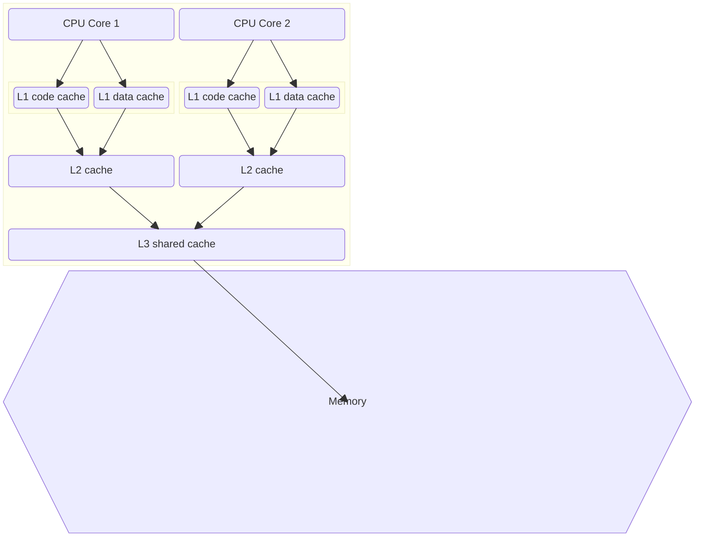
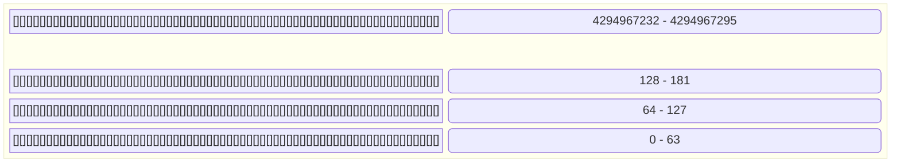

## How to run benchmarks
```
go test -bench=.
```

## Impact of memory address alignment on performance

#### CPU Cache architecture


#### 4 GB of memory divided by cache lines/blocks of 64 bytes each


